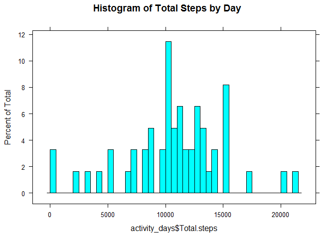
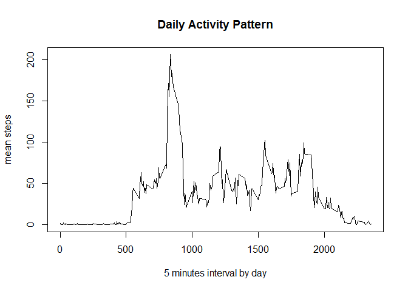
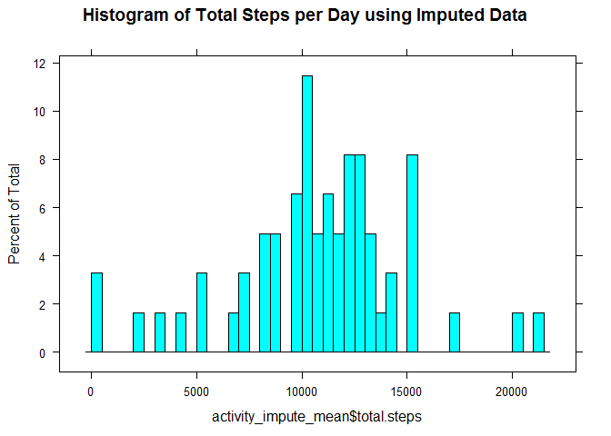
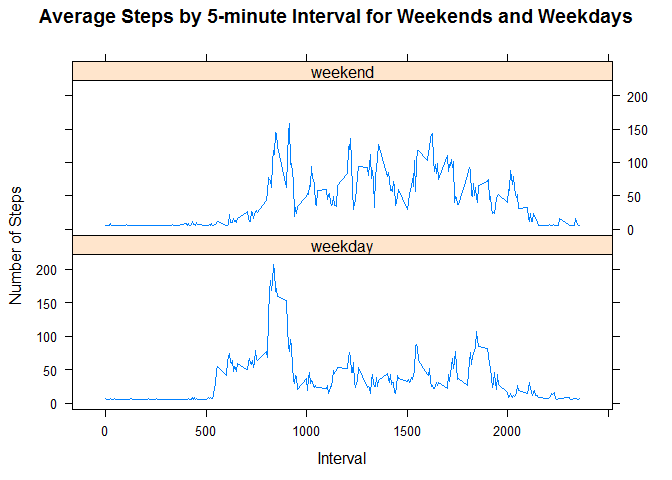

# Reproducible Research: Peer Assessment 1
grace cao  
October 15, 2015  

This is an R Markdown document for Coursera course Reproducible Research project Peer Assessments 1. 
The course assignment can be found here <https://class.coursera.org/repdata-033/human_grading/view/courses/975146/assessments/3/submissions>

This assignment makes use of data from a personal activity monitoring device. This device collects data at 5 minute intervals through out the day. The data consists of two months of data from an anonymous individual collected during the months of October and November, 2012 and include the number of steps taken in 5 minute intervals each day.

The variables included in this dataset are:

* **steps**: Number of steps taking in a 5-minute interval (missing values are coded as NA)

* **date**: The date on which the measurement was taken in YYYY-MM-DD format

* **interval**: Identifier for the 5-minute interval in which measurement was taken

The dataset is stored in a comma-separated-value (CSV) file and there are a total of 17,568 observations in this dataset.

###Loading and preprocessing the data

Set the working directory on my local computer

```r
setwd("C:/Users/grace/Documents/computer-courses/DataScience/ReproducibleResearch/RepData_PeerAssessment1")
```
The following packages are used in my code.

```r
require("dplyr") ## dplyr is used for structuring the data for analysis
require("ggplot2") ## ggplot2 is required for several plots 
require("lattice") ## lattice plot is required for the weekday-weekend plot
options(scipen = 999) ## eliminate scientific notation
options(echo = FALSE)
options(digits = 2)
```

The data set is read in with read.csv, then convert to tbl format to be used by dplyr package

```r
activity <- read.csv("activity.csv", colClasses = c("numeric", "character", "numeric"))
tbl_activity <- tbl_df(activity)
```

### What is mean total number of steps taken per day?

1, load the data, We can ignore the missing values in the dataset.

```r
act_by_days <- group_by(tbl_activity, date)
activity_days <- summarise(act_by_days, Total.steps = sum(steps))
```

2, plot the histogram of the total number of steps taken each day

```r
histogram(activity_days$Total.steps, breaks = 50, main = "Histogram of Total Steps by Day")
```

 

3, calculate the mean and median of total numbers of steps per day

```r
meanSteps <- format(mean((activity_days$Total.steps), na.rm = TRUE), nsmall = 0)
medianSteps <- format(median((activity_days$Total.steps), na.rm = TRUE), nsmall = 0)
```

* mean: 10766
* median: 10765

###What is the average daily activity pattern?

1, Make a time series plot of the the 5-minute interval and average number of steps taken, average across all days


```r
activity_by_interval <- group_by(tbl_activity, interval)
mean_steps_by_interval <- summarise(activity_by_interval, mean.steps = mean(steps, na.rm =TRUE))
plot(mean_steps_by_interval$interval, mean_steps_by_interval$mean.steps, type="l", xlab = "5 minutes interval by day", ylab = "mean steps", main = "Daily Activity Pattern")
```

 

2, Which 5-min interval, contains the maximum number of steps?


```r
max_steps_interval <- which.max(mean_steps_by_interval$mean.steps)
print(mean_steps_by_interval[max_steps_interval,])
```

```
## Source: local data frame [1 x 2]
## 
##   interval mean.steps
##      (dbl)      (dbl)
## 1      835        206
```

###Imputing missing values
1, Calculate and report the total number of missing values in the dataset (i.e. the total number of rows with NAs)

```r
sum(is.na(activity$steps))
```

```
## [1] 2304
```

2, Devise a strategy for filling in all of the missing values in the dataset.

We create a variable weekdays for the data set, then we exam the missing data by day of the week. The missing steps are not even across all the week days

```r
activity$weekday <- weekdays(as.Date(activity$date))
activity$weekday <- factor(activity$weekday, levels= c("Monday",                                                    "Tuesday", "Wednesday", "Thursday", "Friday", "Saturday", "Sunday"))

activity_day_NA <- activity %>% group_by(weekday) %>% summarise(sum(is.na(steps)))
print(activity_day_NA)
```

```
## Source: local data frame [7 x 2]
## 
##     weekday sum(is.na(steps))
##      (fctr)             (int)
## 1    Monday               576
## 2   Tuesday                 0
## 3 Wednesday               288
## 4  Thursday               288
## 5    Friday               576
## 6  Saturday               288
## 7    Sunday               288
```

We are going to use the mean of interval average for each weekday to replace the NAs

3, Create a new dataset that is equal to the original dataset but with the missing data filled in.

First, we calculate the mean of each weekday, then we replace the NAs with mean of each weekday

```r
activity_weekday <- activity %>% group_by(weekday) %>% 
  summarise(mean.steps = mean(steps, na.rm =TRUE))

activity_impute <- merge(activity, activity_weekday, by="weekday")
activity_impute$impute.steps <- ifelse(is.na(activity_impute$steps), 
                                       activity_impute$mean.steps, activity_impute$steps)
```

4, Make a histogram of the total number of steps taken each day 


```r
activity_impute_mean <- activity_impute %>% group_by(date) %>% 
  summarise(total.steps = sum(impute.steps))
histogram(activity_impute_mean$total.steps, breaks = 50, 
     main = "Histogram of Total Steps per Day using Imputed Data")
```

 

Calculate and report the mean and median total number of steps taken per day.

```r
meanSteps_afterAdjust <- format(mean(activity_impute_mean$total.steps), nsmall = 0)
medianSteps_afterAdjust <- format(median(activity_impute_mean$total.steps), nsmall = 0)
```

* mean after adjust: 10821
* median after adjust: 11015

The strategy of replacing the NAs with the means of each weekday does impact the dataset. The mean steps has changed from 10766 to 10821. The median steps has changed from 10765 to 11015. After comparing the histograms before adjusting the data and after adjusting the data, historgrams do not show significent difference because the NAs replacement are across most of the days of the week. 


###Are there differences in activity patterns between weekdays and weekends?
1, Create a new factor variable in the dataset with two levels - "weekday" and "weekend" indicating whether a given date is a weekday or weekend day.

```r
activity_impute <- activity_impute %>% 
  mutate(weekend = ifelse(weekday == "Saturday" | weekday == "Sunday", "weekend", "weekday"))
```
2, Make a panel plot containing a time series plot (i.e. type = "l") of the 5-minute interval (x-axis) and the average number of steps taken, averaged across all weekday days or weekend days (y-axis). 


```r
activity_impute_mean <- activity_impute %>% group_by(weekend, interval) %>% 
  summarise(meansteps = mean(impute.steps))
xyplot(meansteps ~ interval | weekend, data = activity_impute_mean, 
       type = "l", layout = c(1,2), xlab = "Interval", ylab = "Number of Steps", 
       main = "Average Steps by 5-minute Interval for Weekends and Weekdays")
```

 

There exists clear differences in activity between weekends and weekdays. 

* On weekdays, people takes more steps in the early morning, the step increases starting at interval 500, probably due to getting up and goind to work. On weekend, the steps peak not picking up till much later time, maybe due to people sleep in during the weekend. 

* On weekends, the number of steps distributed through out the day, people are more active consistantly through out the daytime frame during weekend. 

* At interval 2000, there is another steps peak on weekend, possibly due to people staying up late doing activities, verse people going to bed early during weekend. 
